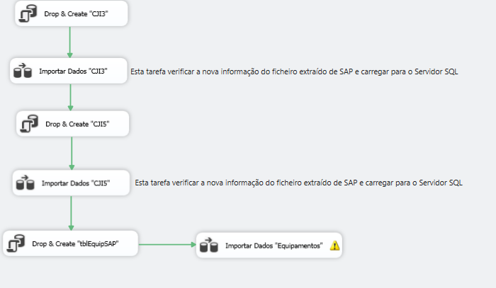
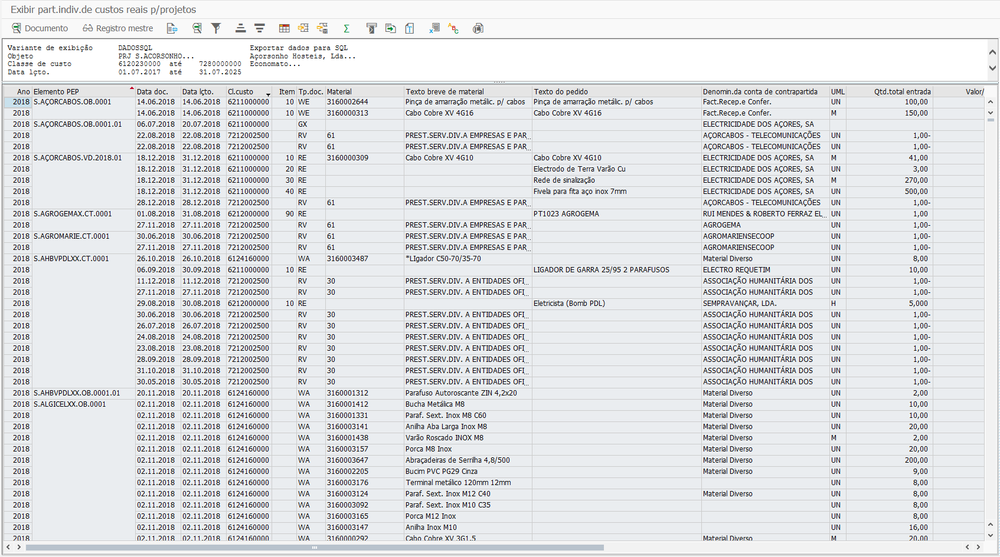
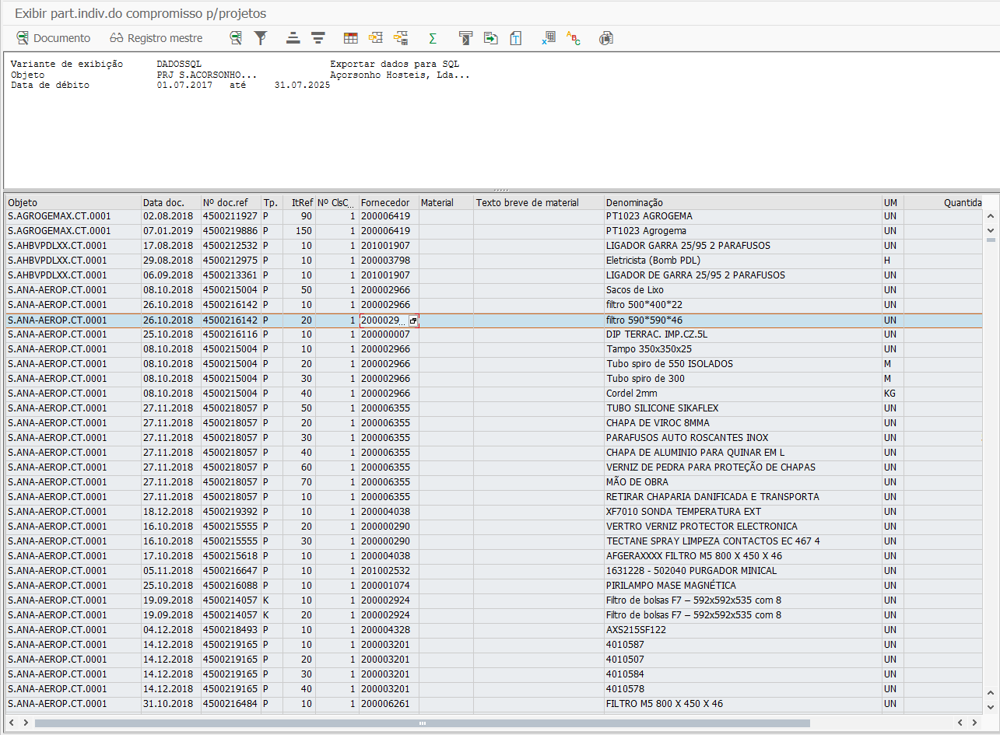
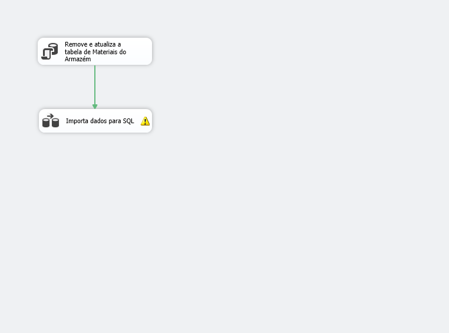
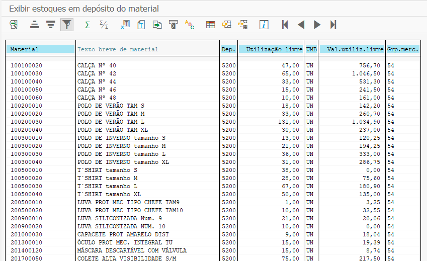
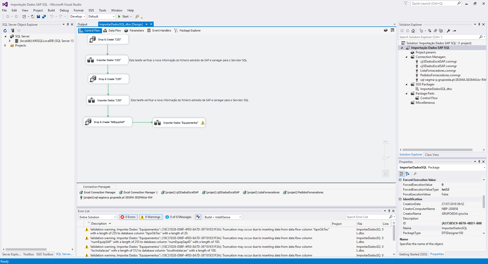
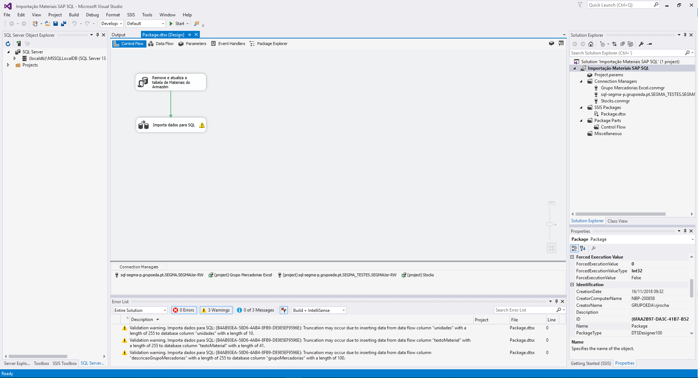

*************************
Exportação de Dados SAP
*************************

Esta secção pretende documentar a extração dos diversos relatórios de custos e download de informação de SAP para SQL Server.

Requisitos
====================================

	
Para a execução da ferramenta de exportação de dados para o Servidor SQL é necessário realizar o download do programa
``SQL Server Data Tools``. 

Download do programa: https://docs.microsoft.com/en-us/sql/ssdt/download-sql-server-data-tools-ssdt?view=sql-server-2017

Local dos ficheiros::

\\smgctpdfs\areas\segma\SEGMA - SUPORTE\13 - BASE DADOS\07 - Relatórios\ 

---------

Importar Resultado Líquido de Obras
====================================

Este ficheiro exporta os diferentes dados referentes à atualização do resultado líquido de todos os PEP's criados, de SAP para SQL Server.

Nome e Local dos ficheiro::

>>Importação Dados SAP SQL.sln
>\\smgctpdfs\areas\segma\SEGMA - SUPORTE\13 - BASE DADOS\07 - Relatórios\Importação Dados SAP SQL

.. Attention:: Para correr com sucesso este ficheiro é fundamental a exportação atualizada das transações infra identificadas.			

CJI3 - Custos Reais
---------------------------

.. sidebar:: Colunas obrigatórias

	Elemento PEP | 
	Data do documento | 
	Data de lançamento | 
	Classe de custo | 
	Item | 
	Tipo de documento | 
	Material | 
	Texto breve de material |
	Texto do pedido |
	Denomin.da conta de contrapartida |
	Unid.medida lançada |
	Qtd.total entrada |
	Valor/moeda ACC |
	Documento de compras |
	Denominação |
	Nº doc.de referência | 
	Nome do usuário | 
	Nº documento | 
	Linha de lançamento | 
	Período

Para a correta execução desta transação deverão ser selecionadas apenas as colunas identificadas no separador à direita. Após execução do relatório, 
transferir o mesmo para a pasta do programa e guardar o ficheiro como ``Folha de Cálculo do Microsoft Excel 97-2003``.

O nome do ficheiro deverá ser ``cji3.xls``.

	
.. Important:: Antes de executar a transação:

 - Selecionar separador :guilabel:`Projeto` e inserir ``S.*``.
 
 - Selecionar separador :guilabel:`Datas de lançamento` e inserir ``01.07.2017 a 31.12.2030``.
 
 - Selecionar separador :guilabel:`Configuração -> Outras Opções`, e selecionar o máximo de ``NºMáxOcorrs.``.
 
CJI5 - Compromissos
---------------------------

.. sidebar:: Colunas obrigatórias

	Objeto | 
	Data do documento |
	Nº doc.de referência |
	Tipo doc.de referência |
	Item referência |
	Nº classif.contábil |
	Fornecedor |
	Material |
	Texto breve de material |
	Denominação |
	Unidade de medida |
	Quantidade total |
	Valor/moeda ACC 

Para a correta execução desta transação deverão ser selecionadas apenas as colunas identificadas no separador à direita. Após execução do relatório, 
transferir o mesmo para a pasta do programa e guardar o ficheiro como ``Folha de Cálculo do Microsoft Excel 97-2003``.

O nome do ficheiro deverá ser ``cji5.xls``.

	
.. Important:: Antes de executar a transação:

 - Selecionar separador :guilabel:`Projeto` e inserir ``S.*``.
 
 - Selecionar separador :guilabel:`Datas de lançamento` e inserir ``01.07.2017 a 31.12.2030``.
 
 - Selecionar separador :guilabel:`Configuração -> Outras Opções`, e selecionar o máximo de ``NºMáxOcorrs.``.
		

MKVZ - Lista Fornecedores
---------------------------

.. sidebar:: Colunas obrigatórias

	Fornecedor | 
	Nome do fornecedor 

Para a correta execução desta transação deverão ser selecionadas apenas as colunas identificadas no separador à direita. Após execução do relatório, 
transferir o mesmo para a pasta do programa e guardar o ficheiro como ``Folha de Cálculo do Microsoft Excel 97-2003``.

O nome do ficheiro deverá ser ``fornecedores.xls``.

.. Note:: Esta lista apenas recolhe o nº e nome do Fornecedor para posterior relação com o relatório dos Pedidos de Compra. 

ME2J - Pedidos p/ projeto
---------------------------

.. sidebar:: Colunas obrigatórias

	Documento de compras |
	Nome do fornecedor 

	
Para a correta execução desta transação deverão ser selecionadas apenas as colunas identificadas no separador à direita. Após execução do relatório, 
transferir o mesmo para a pasta do programa e guardar o ficheiro como ``Folha de Cálculo do Microsoft Excel 97-2003``.

O nome do ficheiro deverá ser ``pedidos.xls``.

.. Important:: Antes de executar a transação:

 - Selecionar separador :guilabel:`Projeto` e inserir ``S.*``.
 
 - Selecionar separador :guilabel:`Organização de Compras` e inserir ``5000 e 5001``.
 
 - Selecionar separador :guilabel:`Abrangência da Lista`, e selecionar o máximo de ``Best_ALV.``.

---------

Importar Dados de Stock 
====================================

Este ficheiro exporta os dados dos materiais e quantidades em stock, conforme o depósito, de SAP para SQL Server.

Nome e Local dos ficheiro::

>>Importação Materiais SAP SQL
>\\smgctpdfs\areas\segma\SEGMA - SUPORTE\13 - BASE DADOS\07 - Relatórios\Importação Materiais SAP SQL\

.. Attention:: Para correr com sucesso este ficheiro é fundamental a exportação atualizada das transações infra identificadas.			

MB52 - Stocks pode depósito
----------------------------

.. sidebar:: Colunas obrigatórias

	Material | 
	Texto breve de material | 
	Depósito | 
	Utilização livre | 
	UM básica | 
	Val.utiliz.livre | 
	Grupo de mercadorias

Para a correta execução desta transação deverão ser selecionadas apenas as colunas identificadas no separador à direita. Após execução do relatório, 
transferir o mesmo para a pasta do programa e guardar o ficheiro como ``Folha de Cálculo do Microsoft Excel 97-2003``

O nome do ficheiro deverá ser ``stocks.xls``.

.. Important:: Antes de executar a transação:

 - Selecionar separador :guilabel:`Centro` e inserir ``5000``.
 
 - Selecionar separador :guilabel:`Depósito` e inserir ``5200``.
 
 - Selecionar :guilabel:`Sem linhas estoque zero`.
 
 - Selecionar :guilabel:`Representação não hierárquica`.

SQLTools - Importar Dados
====================================

Só após executar o programa ``Importação Dados SAP SQL`` e/ou ``Importação Materiais SAP SQL`` e pressionar  :guilabel:`Start` os dados serão descarregados no servidor, com a respetiva indicação de sucesso.

   Importação Dados SAP SQL - **Atualização Resultado Líquido**

   

   Importação Materiais SAP SQL - **Atualização de Stocks**
