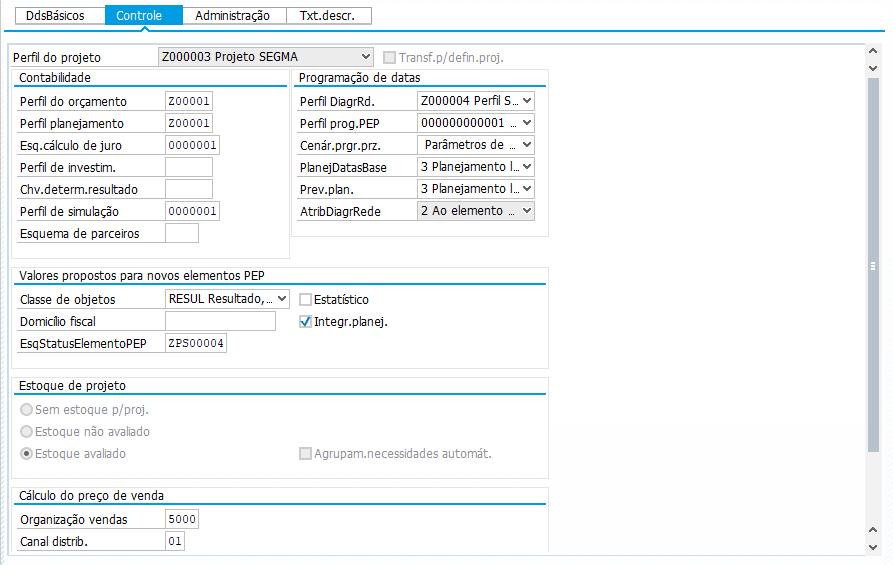
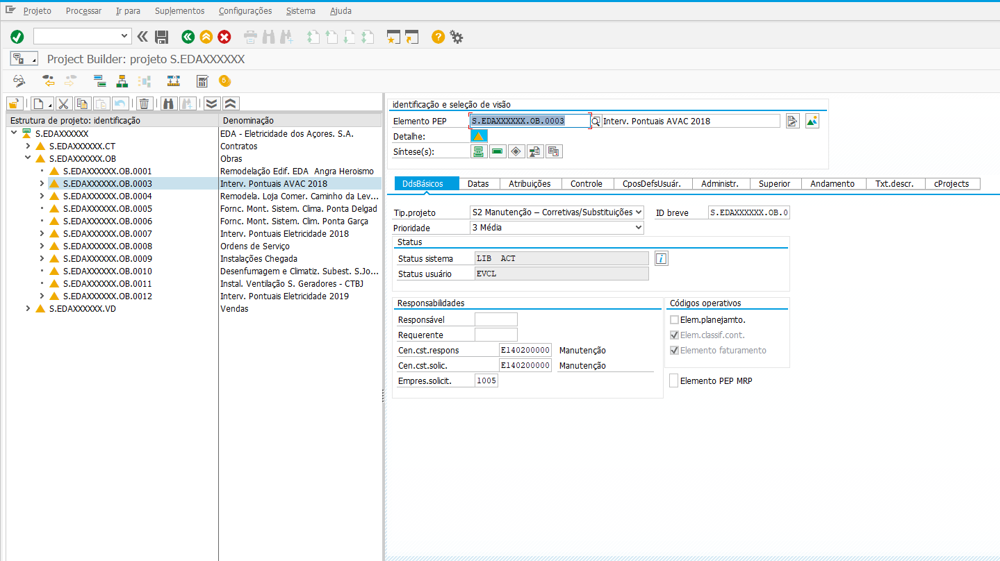
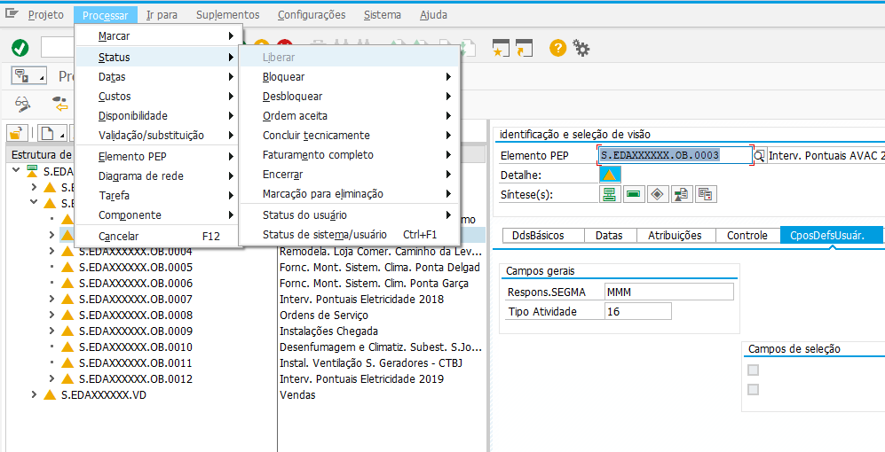
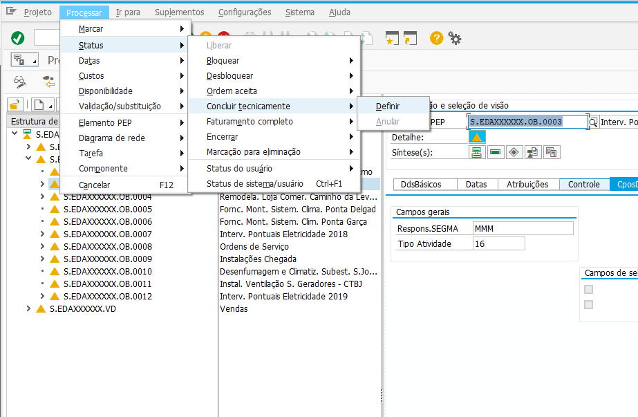

***************
Projetos (PEP)
***************

Esta secção pretende documentar a estrutura, bem como os processos utilizados em SAP, no âmbito da criação e gestão de projetos (PEP).

Estrutura PEP
=======================

Na criação de projetos existem estruturas diferentes consoante o tipo de projeto, seja uma Obra, Contrato ou Vendas. Nas próximas tabelas são apresentadas as diferentes estruturas implmentadas. 

Contratos 
-----------

Estrutura utilizada na criação de projetos do tipo Contrato:

+------------+-------------------------+----------+-----------------------------+
| Nível      | Máscara                 | Caract.  | Denominação                 |
+============+=========================+==========+=============================+
| 1º Nível   | S                       | 1        | Segma                       |
+------------+-------------------------+----------+-----------------------------+
| 2º Nível   | S.EDAXXXXXX             | 9        | Nome Cliente                |
+------------+-------------------------+----------+-----------------------------+
| 3º Nível   | S.EDAXXXXXX.CT          | 2        | Tipo Objeto (CT)            |
+------------+-------------------------+----------+-----------------------------+
| 4º Nível   | S.EDAXXXXXX.CT.0001     | 4        | Nº do Contrato (Sequêncial) |
+------------+-------------------------+----------+-----------------------------+

Obras
-----------

Estrutura utilizada na criação de projetos do tipo Obra:

+------------+-------------------------+----------+--------------------------------+
| Nível      | Máscara                 | Caract.  | Denominação                    |
+============+=========================+==========+================================+
| 1º Nível   | S                       | 1        | Segma                          |
+------------+-------------------------+----------+--------------------------------+
| 2º Nível   | S.EDAXXXXXX             | 9        | Nome Cliente                   |
+------------+-------------------------+----------+--------------------------------+
| 3º Nível   | S.EDAXXXXXX.OB          | 2        | Tipo Objeto (OB)               |
+------------+-------------------------+----------+--------------------------------+
| 4º Nível   | S.EDAXXXXXX.OB.0001     | 4        | Nº da Obra (Sequêncial)        |
+------------+-------------------------+----------+--------------------------------+
| 5º Nível   | S.EDAXXXXXX.OB.0001.01  | 2        | Nº da sub-projeto (Sequêncial) |
+------------+-------------------------+----------+--------------------------------+

.. Important:: Na criação de um projeto de ``Intervenções Pontuais`` é fundamental seguir a seguinte lógica. 
	
	- AVAC: ``Interv. Pontuais AVAC 2018``, consoante o ano corrente; 
	- Eletricidade: ``Interv. Pontuais Eletricidade 2018``, consoante o ano corrente; 
	
Obras - Outros
^^^^^^^^^^^^^^^^^^^^^^

O projeto ``Obras Outros`` corresponde a Clientes em que o volume de negócios é esporádico. Estrutura utilizada na criação de projetos do tipo Obra:

+------------+-------------------------+----------+--------------------------------+
| Nível      | Máscara                 | Caract.  | Denominação                    |
+============+=========================+==========+================================+
| 1º Nível   | S                       | 1        | Segma                          |
+------------+-------------------------+----------+--------------------------------+
| 2º Nível   | S.OUTRO2018             | 9        | Agrupador anual                |
+------------+-------------------------+----------+--------------------------------+
| 3º Nível   | S.OUTRO2018.PRTEXTEI    | 8        | Nome do Cliente                |
+------------+-------------------------+----------+--------------------------------+
| 4º Nível   | S.OUTRO2018.PRTEXTEI.01 | 2        | Nº da Obra (Sequêncial)        |
+------------+-------------------------+----------+--------------------------------+
	
Vendas
-----------

Estrutura utilizada na criação de projetos do tipo Venda:

+------------+-------------------------+----------+--------------------------------+
| Nível      | Máscara                 | Caract.  | Denominação                    |
+============+=========================+==========+================================+
| 1º Nível   | S                       | 1        | Segma                          |
+------------+-------------------------+----------+--------------------------------+
| 2º Nível   | S.EDAXXXXXX             | 9        | Nome Cliente                   |
+------------+-------------------------+----------+--------------------------------+
| 3º Nível   | S.EDAXXXXXX.VD          | 2        | Tipo Objeto (OB)               |
+------------+-------------------------+----------+--------------------------------+
| 4º Nível   | S.EDAXXXXXX.VD.0001     | 4        | Agrupador Anual (Sequêncial)   |
+------------+-------------------------+----------+--------------------------------+
| 5º Nível   | S.EDAXXXXXX.VD.0001.01  | 2        | Registo Venda (Sequêncial)     |
+------------+-------------------------+----------+--------------------------------+

.. Important:: Na criação de um projeto de ``Vendas`` é fundamental seguir a seguinte lógica. 
	
	- O 4º nível deverá sempre, sem exceção, ser associado ao ano corrente;
	
Criar Projeto
=======================	

Através da transação ``CJ20N`` é possível criar um novo Projeto, conforme demonstrado infra. A criação de um Projeto deverá respeitar as normas identificadas supra. 

.. Note:: Deverão ainda ser preenchidos os campos no separador :strong:`Dados Básicos`, respetivos ao centro, 
			localização e centro de lucro.

Criar PEP
=======================

Após criação do Projeto e através da transação ``CJ20N`` é possível criar um novo PEP, conforme demonstrado infra. A criação de um PEP deverá respeitar as normas identificadas supra. 

.. Note:: Campos obrigatórios de preenchimento:

		- :strong:`Tip. Projeto`: variável
		- :strong:`Centro Custo Responsável`: variável
		- :strong:`Centro Custo Solicitante`: variável
		- :strong:`Empresa Solicit`: 1005
		- :strong:`Localização`: variável
		- :strong:`Resp. SEGMA`: variável
		- :strong:`Tipo Atividade`: variável

Liberar PEP
=======================

.. Attention:: Apenas após a liberação é possível a criação de pedidos de compra e/ou imputação de custos.

Encerrar PEP
=======================

.. Caution:: Após o encerramento técnico não será possível imputar nenhuma informação. 

Transções Frequentes
=======================

Transações normalmente utilizadas na gestão de Projetos/PEP's.

+-----------+--------------------------------------------+
| Transaç.  | Descrição                                  |
+===========+============================================+
| CN43N     | Exibir todos os PEP's.                     |
+-----------+--------------------------------------------+
| CN41      | Exibir hierarquicamente todos os PEP's     |
+-----------+--------------------------------------------+
| CJI5      | Compromissos (pedidos por faturar).        |
+-----------+--------------------------------------------+
| CJI3      | Custos reais.                              |
+-----------+--------------------------------------------+
| CJ02      | Modificação em massa de projetos.          |	  
+-----------+--------------------------------------------+

