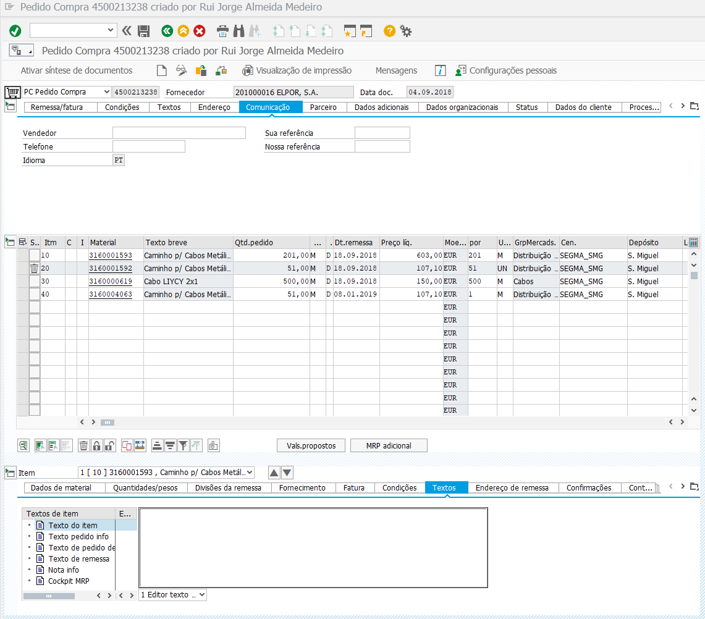
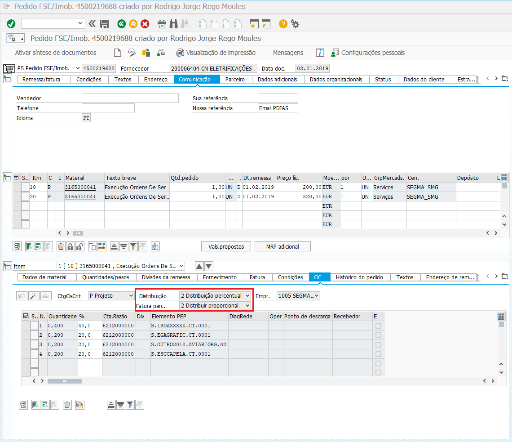

******************
Pedidos de Compra
******************

Esta secção pretende documentar todos os processos na realização de um Pedido de Compra.

Workflow Compras
=======================

.. image:: img/Diagrama_PedidoCompra.PNG

Criar Pedido de Compra
=======================

Através da transação ``ME21N`` é possível criar um novo Pedido de Compra, conforme demonstrado infra. 

.. Note:: Caso o Pedido de Compra tenha como destino material para stock, o tipo de pedido deverá ser :guilabel:`PC Pedido Compra`.

		Caso o Pedido de Compra tenha como destino material para obra, o tipo de pedido deverá ser :guilabel:`PS FSE/Imob.`.
			
.. Important:: Deverá ser preenchido o campo ``Sua Referência``, no separador :guilabel:`Comunicação`, 
				com o respetivo Nº de documento do Fornecedor.
				
				Também deverá ser preenchido o campo ``Nossa Referência``, no separador :guilabel:`Comunicação`, 
				com o respetivo Nº da Requisição de Compra (interno).

Percentagens por PEP
-----------------------

Para criar um Pedido de Compra com percentagem do valor distribuída por PEP's, é necessário selecionar ``2 - Distrubição percentual``, no separador :guilabel:`Clc - > Distribuição`.

Novo Fornecedor/Cliente
=======================

Para a abertura de um novo Fornecedor ou Cliente, para além do preenchimento obrigatório do devido documento, deverá ser 
reencamihado um email para um dos seguintes contatos, para abertura do registo em SAP: 

Abertura de Fornecedores: `enviar email <laguiar@eda.pt>`__.  

Abertura de Clientes: `enviar email <anpastor@eda.pt>`__.

Estratégia de Liberação 
=======================

Para efeitos de estratégia de aprovação, está definido os seguintes critérios:

- Quando o Pedido de Compra ``<= 5000 €``, a aprovação da mesma será feita pelo **Marco Silveira**. 
- Quando o Pedido de Compra ``>= 5000 €``, a aprovação da mesma será feita pelo **Carlos Pereira**. 

