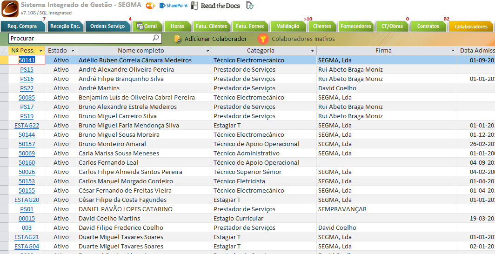
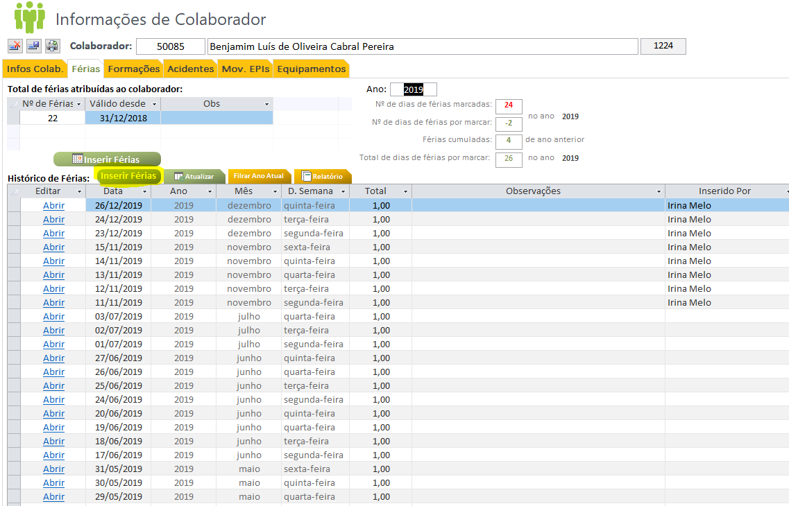
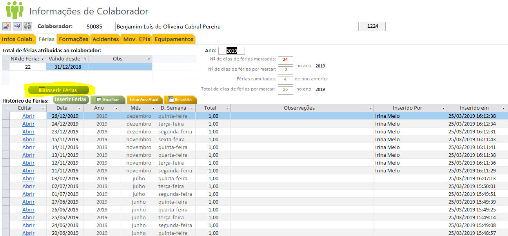
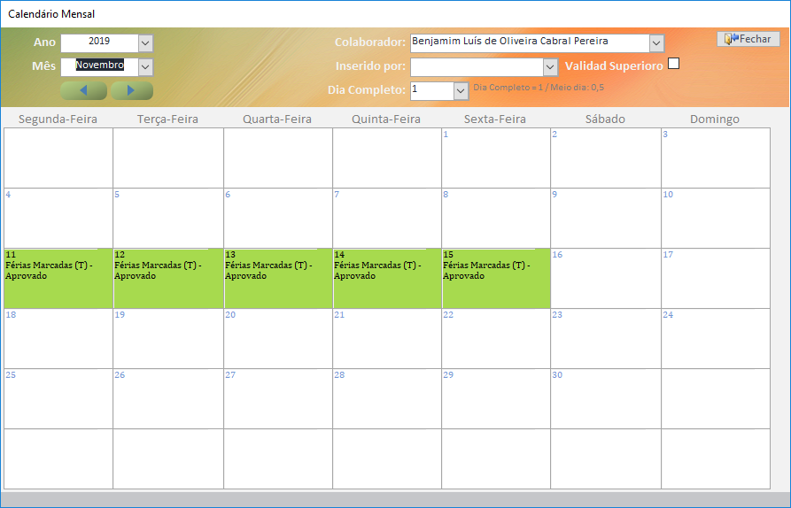
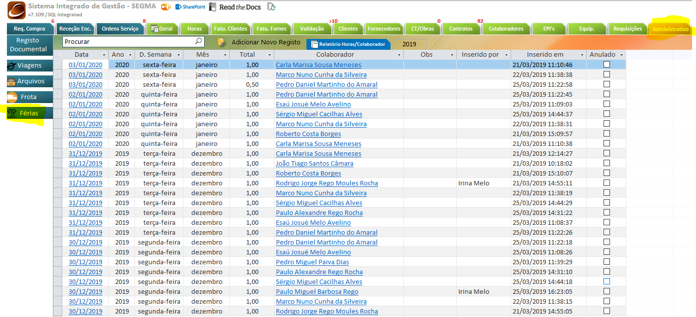
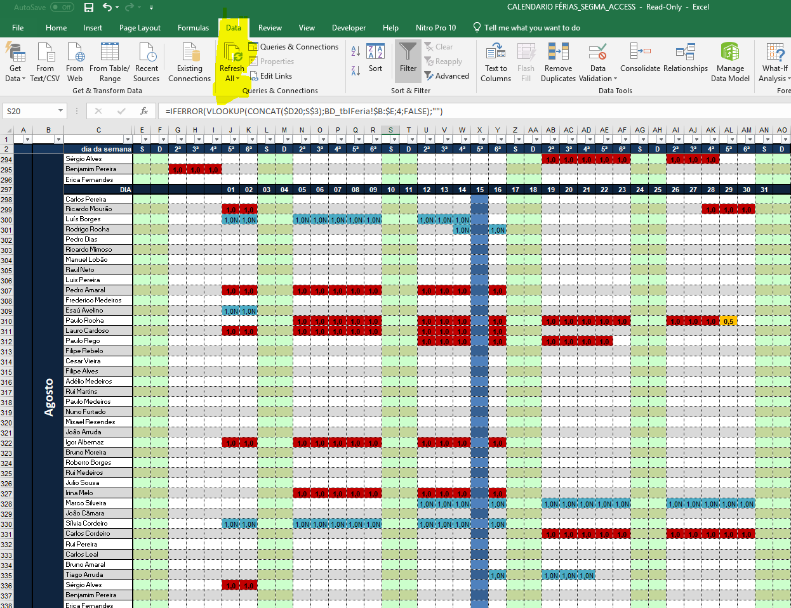
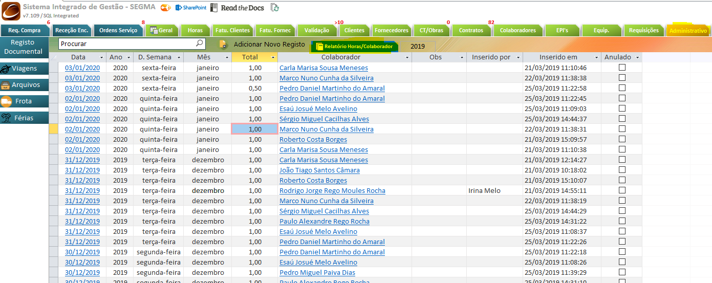
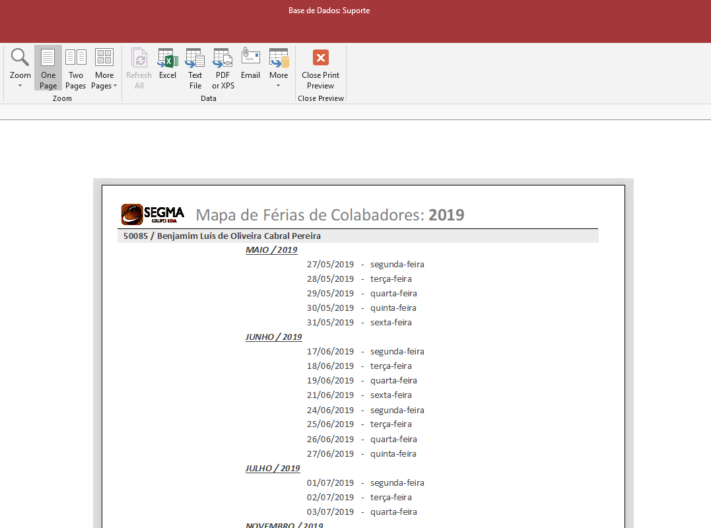

*********************
Gestão de Férias
*********************

Esta secção pretende documentar o processo da gestão de férias. 

Workflow Gestão Férias
================================

O registo e autorização de férias, deverá seguir o seguinte workflow procedimental, sendo registado através da base de dados.

"em desenvolvimento..."	

.. Note:: Todas as férias incialmente introduzidas, por defeito, estão por validar pelo respetivo superior. 
			Caso o superior já tenha validado as férias (folha assinada), deverá ser selecionado o campo :guilabel:`Validado superior` na respetiva data. 
	
Registo Férias
================================

A seguinte secção pretende documentar o registo de férias na base de dados, existindo duas opções, através do painel do Colaborador ou através do painel administrativo. 

Registo diário
---------------------------

Para o registo de férias através do painel do Colaborador, deverá aceder ao separador :guilabel:`Colaboradores` na base de dados de suporte, selecionar o colaborador e clicar no separador :guilabel:`Férias`:

De seguida poderá começar imediatamente o registo de férias, ou através da tabela (última linha) ou clicando em :guilabel:`Inserir Férias`:

Registo Calendarizado
---------------------------

Uma outra alternativa ao registo de férias é através da visão calendarizada mensalmente. Para tal, deverá clicar em :guilabel:`Inserir Férias` com o icon de Calendário.

Irá surgir uma janela com o mês selecionado, sendo possível através deste formulário inserir férias apenas com um clique no dia escolhido:

		
.. Note:: É possível a visualização e edição do registo de férias diretamente através desta interface, apenas sendo necessário clicar no dia escolhido. 

.. Note:: Deverá ser preenchido o campo :guilabel:`Inserido Por`, pela pessoa responsável pelo registo na base de dados de Suporte.
		
Listagem Geral
---------------------------

É possível também inserir férias através do painel :guilabel:`Administrativo`, sendo que o registo é identifco ao documentado no ponto  ``7.2.1``.

Relatórios de Férias Marcadas
================================

Para a exportação/visualização de férias por Colaborador é possível extrair um relatório através da base de dados (painel :guilabel:`Administrativo`) ou através do Excel automatizado de férias.

Excel Calendarizado
----------------------------------

Através deste Excel é possível visualizar todas as férias marcadas, conforme os registos na Base de Dados. 

Local do ficheiro:

>>\\smgctpdfs\areas\segma\SEGMA - TÉCNICA\3 - RECURSOS HUMANOS\111 - 2019\1 - MAPA DE FÉRIAS

.. Important:: É fundamental atualizar os dados aquando da abertura do ficheiro. 

.. Note:: As cores identificadas no excel têm a seguinte representação: 
	
	- Vermelho: Dia completo marcado Validado Superiormente);
	
	- Amarelo: Dia parcial marcado Validado Superiormente);
	
	- Azul: Dia por validar superiormente;

Relatórios Mapa de Férias
----------------------------------

Para retirar a folha de registo de férias, por Colaborador, deverá clicar no  painel :guilabel:`Administrativo - > Férias` e selecionar :guilabel:`Relatórios Férias/Colaborador`, este será o mapa de férias. 

.. Note:: Deverá selecionar o ano antes da extração do mapa de férias. 

Após selecionado o ano ``2019`` é gerado o seguinte mapa de férias: 

É possível imprimir este documento. 