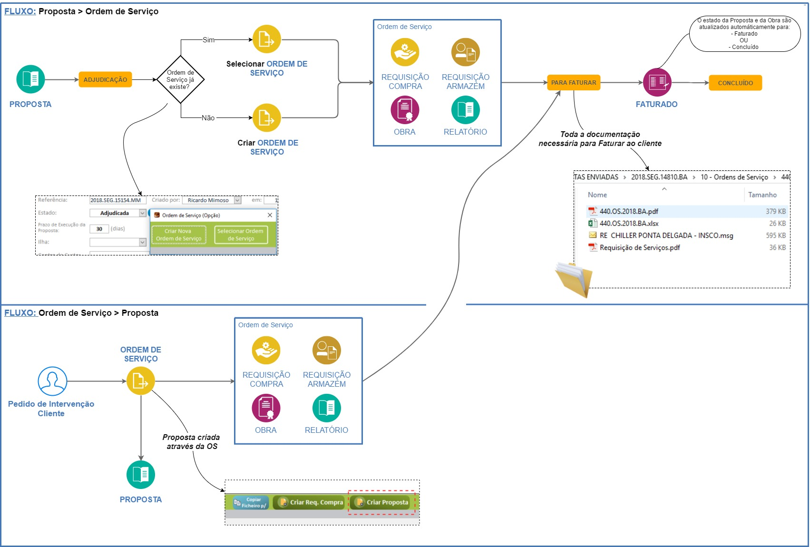
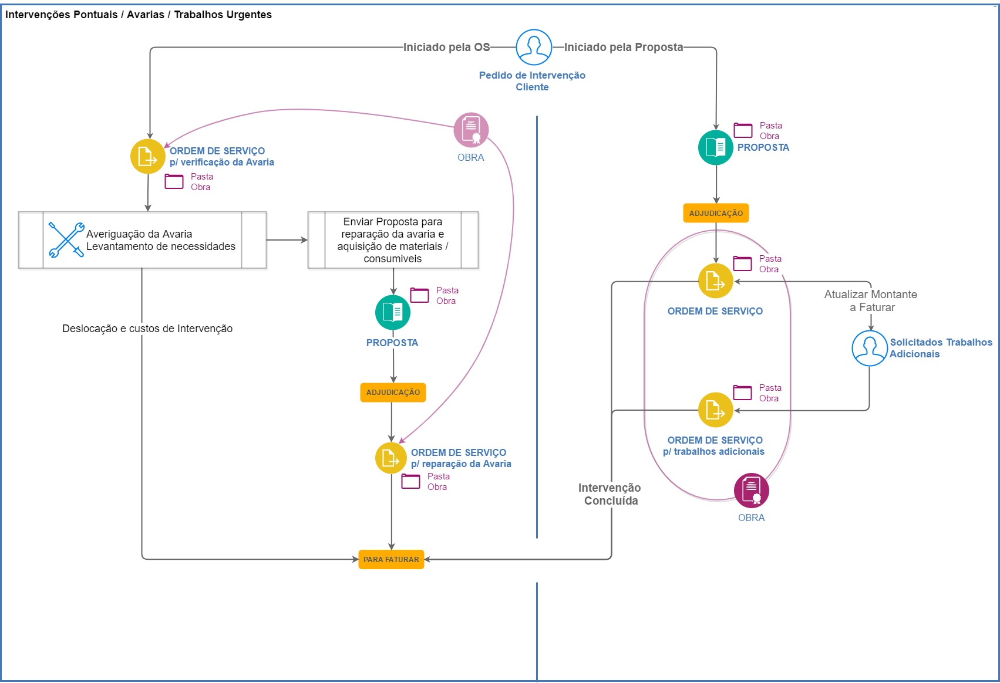
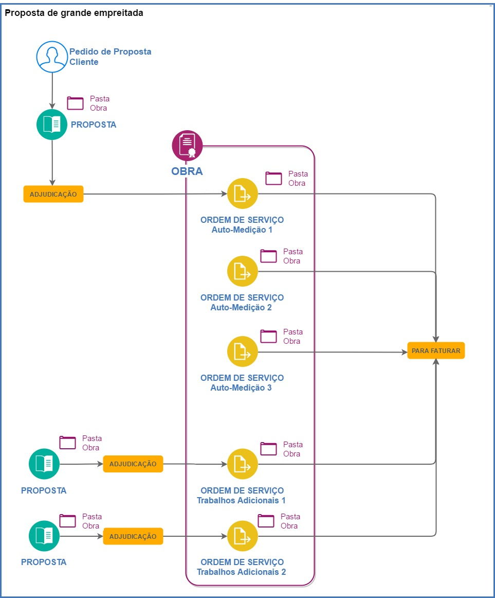

*****************
Ordens de Serviço
*****************

.. contents:: Tabela de Conteudos

Workflow OS
============================

Os seguintes diagramas pretendem demonstrar as duas alternativas possíveis para criação de uma OS, seja através de uma proposta ou diretamente atravês do registo da OS. 

Criar OS
============================

Em desenvolvimento...

Criar OS da Proposta
============================

Em desenvolvimento...

Associar OS
============================

Em desenvolvimento...

Casos Práticos Ordens Serv.
============================

Intervenções Pontuais / Avarias
-------------------------------------

O seguinte worflow demonstra duas alternativas, a primeira através da execução de um trabalho (tipicamente uma avaria) diretamente através da criação de uma OS, enquanto que o outro apenas é executado após adjudicação de um Proposta, com a possibilidade de criação de uma 2ª OS para faturação de trabalhos adicionais.

Faturação c/ autos de medição 
-------------------------------------

