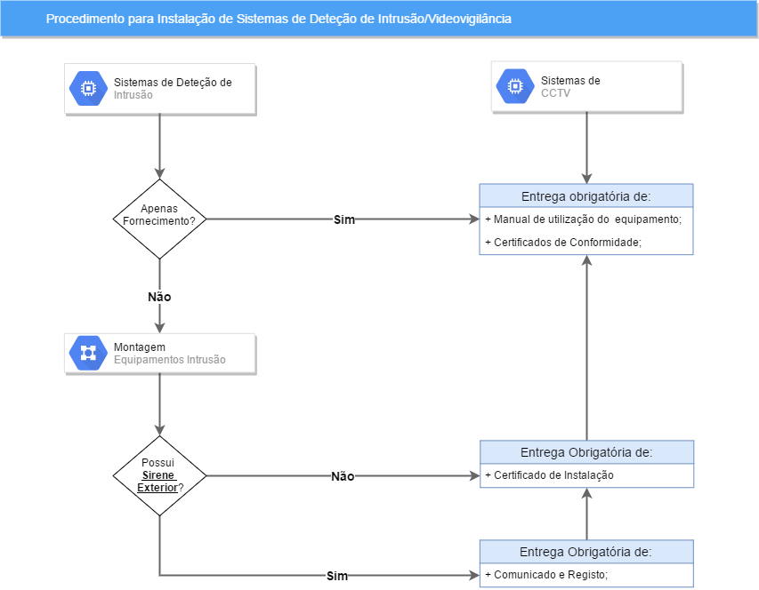

***************************************************
Sistemas Deteção Intrusão/Videovigilância
***************************************************

Objetivo
=================================

Esta seção têm como principal objetivo documentar e explicar o procedimento para instalação de sistemas de deteção de intrusão e/ou videovigiliância.

Procedimento de Registo
=================================

Perguntas mais frequentes
=================================

Qual a responsabilidade da SEGMA? 
-----------------------------------

- A SEGMA não é empresa de segurança privada (ver legislação abaixo).
- A SEGMA não realiza exploração de equipamentos de segurança, tratamento de dados e imagens privados ou receção e tratamento de alarmes.
- A SEGMA realiza de venda, instalação, manutenção e assistência técnica de material e equipamento de segurança ou de centrais de alarme.

	.. important:: É obrigatório o registo prévio na PSP, pois a SEGMA não se enquandra em alvará de empresa de segurança privada. 

Qual é o procedimento caso ocorra um alarme no sistema instalado?
----------------------------------------------------------------------

Caso ocorra uma deteção no sistema instalado com sirene exterior, em que a PSP seja alertada o cliente poderá solicitar apoio à SEGMA para elaboração de um relatório técnico a enviar à PSP no prazo de 10 dias.

.. note:: Apenas caso o sistema esteja instalado com uma sirene exterior. 

Quem é o responsável pela colocação de aviso/sinalização?
----------------------------------------------------------------------

A empresa de segurança privada, quando esta seja responsável pelo tratamento de dados”. 

Como a SEGMA não realiza tratamento de dados, o cliente é que é responsável pela colocação do aviso e sinalização do sistema de videovigilância. No entanto a SEGMA poderá alertar o cliente para esta necessidade.

Onde se encontra o alvará? 
----------------------------------------------------------------------

Apenas é obrigatório o registo prévio na PSP. (número a ser disponibilizado brevemente..)

Legislação
============================

Nas próximas seções encontra-se a legislação a ter em conhecimento. 

Lei 34/2013 - Estabelece o regime de exerc. da actividade de segurança
--------------------------------------------------------------------------

  .. note:: Lei 34/2013 - Estabelece o regime do exercício da atividade de segurança privada e procede à primeira alteração à Lei n.º 49/2008, de 27 de agosto (Lei de Organização da Investigação Criminal)

Artigo 11.º - Instalação de dispositivos de alarme com sirene
~~~~~~~~~~~~~~~~~~~~~~~~~~~~~~~~~~~~~~~~~~~~~~~~~~~~~~~~~~~~~~~~~~

1. A instalação de dispositivos de alarme em imóvel que possua sirene exterior ou equipamento de comunicação suscetível de desencadear uma chamada para o número nacional de emergência ou das forças de segurança está sujeita a comunicação e registo na autoridade policial da área, no prazo de cinco dias úteis posteriores à sua montagem.
2. A comunicação a que se refere o número anterior é efetuada pelo proprietário ou utilizador do alarme e contém o nome, a morada e o contacto das pessoas ou serviços que, permanentemente ou por escala, podem em qualquer momento desligar o aparelho que haja sido acionado.
3. O proprietário ou utilizador do alarme assegura que o próprio ou as pessoas ou serviços referidos no número anterior, no prazo de três horas, contadas a partir da comunicação da autoridade policial competente, comparece no local e procede à reposição do alarme.
4. Os requisitos técnicos dos equipamentos, condições de funcionamento e modelo de comunicação a que se refere o n.º 2 são aprovados por portaria do membro do Governo responsável pela área da administração interna.

Artigo 12.º - Empresas de segurança privada
~~~~~~~~~~~~~~~~~~~~~~~~~~~~~~~~~~~~~~~~~~~~~~~~~~~~~~~~~~~~~~~~~~

2.  Não são consideradas empresas de segurança privada as pessoas, singulares ou coletivas, cujo objeto seja a prestação de serviços a terceiros de conceção, de venda, de instalação, de manutenção ou de assistência técnica de material e equipamento de segurança ou de centrais de alarme.
3.  Sem prejuízo do disposto no número anterior, as entidades que procedam ao estudo e conceção, instalação, manutenção ou assistência técnica de material e equipamento de segurança ou de centrais de alarme são obrigadas a registo prévio na Direção Nacional da Polícia de Segurança Pública (PSP).

Portaria n.º 273-2013 - Regulas as condições de prestação de seg. privada
--------------------------------------------------------------------------

	.. note:: Portaria n.º 273-2013- Regula as condições específicas da prestação dos serviços de segurança privada, o modelo de cartão profissional e os procedimentos para a sua emissão e os requisitos técnicos dos equipamentos, funcionamento e modelo de comunicação de alarmes

	.. Attention:: Capítulo X - Instalação de dispositivos de alarme e de segurança 
				 Secção I - Comunicação, registo e condições de funcionamento 

Artigo 106.º - Comunicação e registo
~~~~~~~~~~~~~~~~~~~~~~~~~~~~~~~~~~~~~~~~~~~~~~~~~~~~~~~~~~~~~~~~~~

1. A comunicação prevista no n.º 1 do artigo 11.º da Lei n.º 34/2013, de 16 de maio, é efetuada pelo proprietário ou utilizador do alarme, mediante impresso de modelo próprio, que constitui o anexo VII à presente portaria, dela fazendo parte integrante, sendo disponibilizado gratuitamente nas páginas oficiais das forças de segurança. 
2. A comunicação prevista no número anterior poderá ser submetida por via eletrónica, desde que garantida a autenticação dos utilizadores através de certificados digitais, designadamente através do cartão do cidadão.
3. A comunicação a que se refere o n.º 1 deve conter obrigatoriamente os dados de identificação, morada e contatos telefónicos das pessoas ou serviços que, permanentemente ou por escala, podem em qualquer momento desligar o aparelho quando em alarme.

Artigo 107.º - Requisitos técnicos dos equipamentos
~~~~~~~~~~~~~~~~~~~~~~~~~~~~~~~~~~~~~~~~~~~~~~~~~~~~~~~~~~~~~~~~~~

1. São aplicáveis aos equipamentos de alarme os requisitos técnicos previstos na presente portaria.
2. O instalador autorizado de material e equipamento de segurança deve emitir um certificado de instalação garantindo a conformidade com as normas referidas no número anterior.
3. Todas as intervenções de manutenção e assistência técnica de material e equipamento de segurança devem ser anotadas no livro de registos relativo ao sistema instalado.

	.. Attention:: Secção II - Requisitos técnicos aplicáveis a sistemas de segurança

Artigo 111.º - Graus de segurança dos sistemas de alarme
~~~~~~~~~~~~~~~~~~~~~~~~~~~~~~~~~~~~~~~~~~~~~~~~~~~~~~~~~~~~~~~~~~

1. Sem prejuízo do disposto na presente portaria ou em legislação especial, são aplicáveis aos sistemas de alarme os graus de segurança previstos na norma EN 50131-1, ou equivalente, nas seguintes condições:
	a) **Grau 1** para sistemas de alarme dotados de sinalização acústica, não conectados a central de receção e monitorização de alarmes;
	b) **Grau 2** para sistemas instalados em residências ou outros estabelecimentos não obrigados a adotar sistemas de segurança obrigatórios, e que estejam ligados a centrais de receção e monitorização de alarmes ou a centro de controlo;
	c) **Grau 3** para sistemas instalados em empresas ou entidades industriais, comerciais e de serviços que devam adotar medidas de segurança previstas no artigo 8.º da Lei n.º 34/2013, de 16 de maio, e que estejam ligados a centrais de receção e monitorização de alarmes ou a centro de controlo;
	d) **Grau 4** para sistemas em instalações classificadas de infraestruturas críticas, instalações militares ou das forças e serviços de segurança, instalações de armazenamento de explosivos e substâncias explosivas, instalações previstas nos artigos 8.º e 9.º e instalações de depósito e guarda de valores e metais preciosos.
2. O disposto nas alíneas c) e d) no número anterior só é aplicável a novas instalações, devendo as existentes adaptar-se ao grau de segurança previsto no prazo de 3 anos após a entrada em vigor da presente portaria.
3. Por despacho do diretor nacional da PSP pode ser autorizado grau inferior ao previsto no n.º 1 quando demonstrada a existência de medidas complementares de segurança que assegurem o adequado nível de segurança.

Artigo 113.º - Certificado de instalação
~~~~~~~~~~~~~~~~~~~~~~~~~~~~~~~~~~~~~~~~~~~~~~~~~~~~~~~~~~~~~~~~~~

1. O projeto de instalação de um sistema de alarme deve ser elaborado de harmonia com a norma CLC/TS 50131-7 de modo a minimizar a ocorrência de falsos alarmes. 
2. O instalador autorizado de material e equipamento de segurança deve emitir um **certificado de instalação** garantindo a conformidade com a norma CLC/TS 50131-7, nas partes aplicáveis à instalação de alarmes. 
3. Todas as intervenções de manutenção e assistência técnica de material e equipamento de segurança devem ser anotados no livro de registos relativo ao sistema instalado.

Anexos 
============================

Nesta seção encontram-se todos os anexos necessários.  

Na seguinte pasta da rede estão também disponíveis todos os documentos adicionais que sejam necessários consultar: 

::

	\\smgctpdfs\areas\SEGMA\SEGMA - SUPORTE\10 - REG. ASSOCIAÇÕES E CERTIFICAÇÕES\SIGESP - PSP - INTRUSÃO\ 

Comunicação de Instalação de Alarme
---------------------------------------

Para descarregar o ficheiro PDF, clique em:
:download:`Comunicaçao de alarmes.pdf <files/Comunicaçao de alarmes.pdf>`.

Certificado de Instalação
---------------------------------------

Para descarregar o ficheiro Word, clique em:
:download:`Certificado de Instalação.doc <files/Certificado de Instalação.docx>`.
